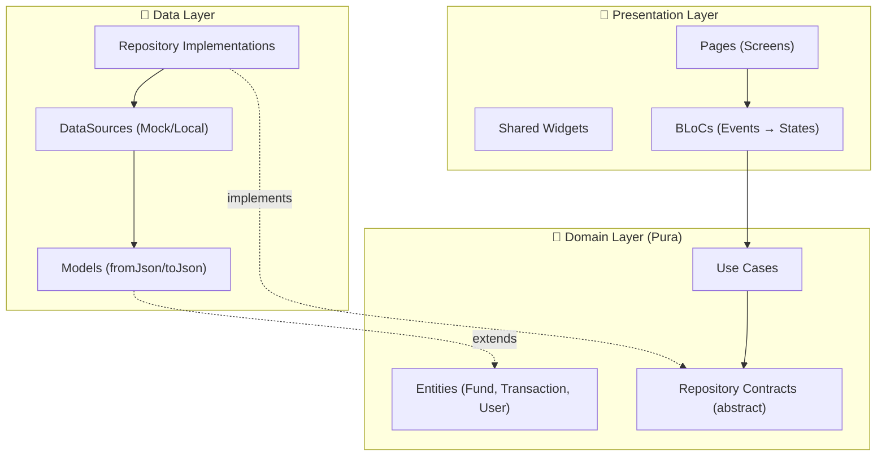

# BTG Funds Manager — Plan de Implementación

Plan de arquitectura e implementación para la prueba técnica de BTG Pactual: una app Flutter para gestión de fondos de inversión (FPV/FIC).

## Principios Rectores

| Principio | Aplicación en el proyecto |
|---|---|
| **Clean Architecture** | 3 capas: Domain → Data → Presentation, con dependencias hacia adentro |
| **BLoC** | Business Logic Components como intermediarios entre Vista y Lógica de Negocio. Eventos → BLoC → Estados |
| **Programación Funcional** | Uso de `Either`/`Result` para manejo de errores, funciones puras en use cases, inmutabilidad con `freezed` |
| **SOLID** | Interfaces (abstract classes) para repositorios, single responsibility por clase |
| **DRY / KISS** | Widgets reutilizables, composición sobre herencia |

---

## Arquitectura General



---

## Estructura de Carpetas

```
lib/
├── main.dart
├── app.dart                          # MaterialApp + GoRouter + MultiBlocProvider
│
├── core/
│   ├── theme/
│   │   ├── app_theme.dart            # ThemeData, ColorScheme
│   │   └── app_text_styles.dart      # Estilos tipográficos
│   ├── constants/
│   │   └── app_constants.dart        # Saldo inicial, categorías, etc.
│   ├── router/
│   │   └── app_router.dart           # GoRouter config
│   ├── di/
│   │   └── injection_container.dart  # GetIt / service locator setup
│   ├── utils/
│   │   ├── currency_formatter.dart   # Formateo COP
│   │   └── result.dart               # Sealed class Result<T> (Success|Failure)
│   └── widgets/                      # Widgets reutilizables globales
│       ├── btg_card.dart
│       ├── btg_button.dart
│       ├── error_snackbar.dart
│       └── loading_overlay.dart
│
├── features/
│   ├── funds/
│   │   ├── domain/
│   │   │   ├── entities/
│   │   │   │   └── fund.dart         # Fund entity (inmutable)
│   │   │   ├── repositories/
│   │   │   │   └── fund_repository.dart  # Abstract contract
│   │   │   └── use_cases/
│   │   │       ├── get_funds.dart
│   │   │       ├── subscribe_to_fund.dart
│   │   │       └── cancel_subscription.dart
│   │   ├── data/
│   │   │   ├── models/
│   │   │   │   └── fund_model.dart   # JSON serialization
│   │   │   ├── datasources/
│   │   │   │   └── fund_local_datasource.dart  # Mock data
│   │   │   └── repositories/
│   │   │       └── fund_repository_impl.dart
│   │   └── presentation/
│   │       ├── bloc/
│   │       │   ├── funds_bloc.dart        # BLoC: maneja eventos y emite estados
│   │       │   ├── funds_event.dart       # Eventos: LoadFunds, Subscribe, Cancel
│   │       │   └── funds_state.dart       # Estados: Loading, Loaded, Error
│   │       ├── pages/
│   │       │   └── funds_page.dart
│   │       └── widgets/
│   │           ├── fund_card.dart
│   │           └── subscribe_dialog.dart
│   │
│   └── transactions/
│       ├── domain/
│       │   ├── entities/
│       │   │   └── transaction.dart
│       │   ├── repositories/
│       │   │   └── transaction_repository.dart
│       │   └── use_cases/
│       │       └── get_transaction_history.dart
│       ├── data/
│       │   ├── models/
│       │   │   └── transaction_model.dart
│       │   ├── datasources/
│       │   │   └── transaction_local_datasource.dart
│       │   └── repositories/
│       │       └── transaction_repository_impl.dart
│       └── presentation/
│           ├── bloc/
│           │   ├── transactions_bloc.dart
│           │   ├── transactions_event.dart
│           │   └── transactions_state.dart
│           ├── pages/
│           │   └── transactions_page.dart
│           └── widgets/
│               └── transaction_tile.dart
│
test/
├── core/
│   └── utils/
│       ├── currency_formatter_test.dart
│       └── result_test.dart
├── features/
│   ├── funds/
│   │   ├── domain/use_cases/
│   │   │   ├── get_funds_test.dart
│   │   │   ├── subscribe_to_fund_test.dart
│   │   │   └── cancel_subscription_test.dart
│   │   ├── data/repositories/
│   │   │   └── fund_repository_impl_test.dart
│   │   └── presentation/
│   │       └── pages/funds_page_test.dart
│   └── transactions/
│       ├── domain/use_cases/
│       │   └── get_transaction_history_test.dart
│       └── presentation/
│           └── pages/transactions_page_test.dart
```

---

## Dependencias Propuestas

```yaml
dependencies:
  flutter:
    sdk: flutter
  # Estado (BLoC)
  flutter_bloc: ^9.1.0           # BLoC widgets (BlocProvider, BlocBuilder, etc.)
  bloc: ^9.0.0                   # Core BLoC library
  equatable: ^2.0.7              # Comparación de objetos por valor (Events/States)

  # Inyección de dependencias
  get_it: ^8.0.3                 # Service locator
  injectable: ^2.5.0             # Annotations para DI

  # Inmutabilidad + Unions
  freezed_annotation: ^2.4.6     # Annotations para freezed

  # Navegación
  go_router: ^14.8.1             # Declarative routing

  # UI
  google_fonts: ^6.2.1           # Tipografías premium
  intl: ^0.19.0                  # Formateo de moneda/fechas

dev_dependencies:
  flutter_test:
    sdk: flutter
  flutter_lints: ^6.0.0
  build_runner: ^2.4.14
  freezed: ^2.5.8                # Code gen inmutabilidad
  injectable_generator: ^2.7.0   # Code gen DI
  mocktail: ^1.0.4               # Mocking para tests
  bloc_test: ^9.1.7              # Testing utilities para BLoC
```

> [!NOTE]
> Se utiliza `freezed` para inmutabilidad en entities/models, `flutter_bloc` para manejo de estado con el patrón BLoC (Events → States), `equatable` para comparación por valor, y `get_it` + `injectable` para inyección de dependencias.

---

## Propuestas de Cambio por Componente

### Core — Utilidades, DI y Configuración

#### [NEW] [injection_container.dart](file:///Users/ander/Desktop/prueba%20tecnica/btg_funds_manager/lib/core/di/injection_container.dart)
Service locator con `get_it` + `injectable`. Registra DataSources, Repositories, Use Cases y BLoCs.

#### [NEW] [result.dart](file:///Users/ander/Desktop/prueba%20tecnica/btg_funds_manager/lib/core/utils/result.dart)
Sealed class `Result<T>` con variantes `Success(T data)` y `Failure(String message)` — patrón funcional para evitar excepciones en la lógica de negocio.

#### [NEW] [app_constants.dart](file:///Users/ander/Desktop/prueba%20tecnica/btg_funds_manager/lib/core/constants/app_constants.dart)
Constantes: saldo inicial (`500000`), categorías de fondos, mensajes de error.

#### [NEW] [currency_formatter.dart](file:///Users/ander/Desktop/prueba%20tecnica/btg_funds_manager/lib/core/utils/currency_formatter.dart)
Función pura `String formatCOP(double amount)` que formatea valores a `COP $xxx.xxx`.

#### [NEW] [app_theme.dart](file:///Users/ander/Desktop/prueba%20tecnica/btg_funds_manager/lib/core/theme/app_theme.dart)
`ThemeData` con Material 3, paleta de colores BTG (azul corporativo), tipografía Google Fonts.

#### [NEW] [app_router.dart](file:///Users/ander/Desktop/prueba%20tecnica/btg_funds_manager/lib/core/router/app_router.dart)
Configuración GoRouter con rutas: `/funds` (home), `/transactions`.

---

### Feature: Funds

#### [NEW] [fund.dart](file:///Users/ander/Desktop/prueba%20tecnica/btg_funds_manager/lib/features/funds/domain/entities/fund.dart)
Entity inmutable con `freezed`: `id`, `name`, `minimumAmount`, `category` (enum FPV/FIC), `isSubscribed`.

#### [NEW] [fund_repository.dart](file:///Users/ander/Desktop/prueba%20tecnica/btg_funds_manager/lib/features/funds/domain/repositories/fund_repository.dart)
Contrato abstracto:
- `Future<Result<List<Fund>>> getFunds()`
- `Future<Result<Fund>> subscribeTo(int fundId, NotificationMethod method)`
- `Future<Result<Fund>> cancelSubscription(int fundId)`

#### [NEW] Use Cases: `GetFunds`, `SubscribeToFund`, `CancelSubscription`
Cada use case es una clase con un solo método `call()` — principio SRP. Valida reglas de negocio:
- **SubscribeToFund**: verifica que el saldo del usuario ≥ monto mínimo del fondo.
- **CancelSubscription**: devuelve el monto al saldo del usuario.

#### [NEW] [fund_model.dart](file:///Users/ander/Desktop/prueba%20tecnica/btg_funds_manager/lib/features/funds/data/models/fund_model.dart)
Modelo con `fromJson`/`toJson`, extiende (mapea a) `Fund` entity.

#### [NEW] [fund_local_datasource.dart](file:///Users/ander/Desktop/prueba%20tecnica/btg_funds_manager/lib/features/funds/data/datasources/fund_local_datasource.dart)
Data source mock con los 5 fondos de la prueba. Simula latencia con `Future.delayed`.

#### [NEW] [fund_repository_impl.dart](file:///Users/ander/Desktop/prueba%20tecnica/btg_funds_manager/lib/features/funds/data/repositories/fund_repository_impl.dart)
Implementación concreta del contrato `FundRepository`.

#### [NEW] BLoC: `FundsBloc`, `FundsEvent`, `FundsState`
- **Events**: `LoadFunds`, `SubscribeToFund(fundId, notificationMethod)`, `CancelFundSubscription(fundId)` — extienden `Equatable`.
- **States**: `FundsInitial`, `FundsLoading`, `FundsLoaded(funds, balance)`, `FundsError(message)`, `FundsSubscriptionSuccess(message)` — sealed con `freezed`.
- **BLoC**: Recibe eventos, invoca use cases, emite nuevos estados. Usa `emit` para transiciones de estado.

#### [NEW] [funds_page.dart](file:///Users/ander/Desktop/prueba%20tecnica/btg_funds_manager/lib/features/funds/presentation/pages/funds_page.dart)
Página principal con `BlocProvider` + `BlocBuilder`/`BlocListener`:
- Encabezado que muestra saldo actual
- Lista de fondos (cards) con indicador de suscripción
- FAB o bottom navigation para ir a transacciones

#### [NEW] [fund_card.dart](file:///Users/ander/Desktop/prueba%20tecnica/btg_funds_manager/lib/features/funds/presentation/widgets/fund_card.dart)
Widget reutilizable: card con nombre, mínimo, categoría, botón suscribir/cancelar.

#### [NEW] [subscribe_dialog.dart](file:///Users/ander/Desktop/prueba%20tecnica/btg_funds_manager/lib/features/funds/presentation/widgets/subscribe_dialog.dart)
Modal/dialog con selector de método de notificación (Email/SMS) y confirmación.

---

### Feature: Transactions

#### [NEW] [transaction.dart](file:///Users/ander/Desktop/prueba%20tecnica/btg_funds_manager/lib/features/transactions/domain/entities/transaction.dart)
Entity inmutable: `id`, `fundId`, `fundName`, `type` (enum: subscription/cancellation), `amount`, `date`, `notificationMethod`.

#### [NEW] Capa completa (domain/data/presentation)
Estructura idéntica a Funds. El `TransactionsBloc` consume `GetTransactionHistory` use case.

#### [NEW] [transactions_page.dart](file:///Users/ander/Desktop/prueba%20tecnica/btg_funds_manager/lib/features/transactions/presentation/pages/transactions_page.dart)
Lista de transacciones con detalles: fecha, fondo, tipo, monto. Ordenadas por fecha descendente.

---

### App Shell

#### [MODIFY] [main.dart](file:///Users/ander/Desktop/prueba%20tecnica/btg_funds_manager/lib/main.dart)
Reemplazar counter app con inicialización de `GetIt` (DI) + `App()`.

#### [NEW] [app.dart](file:///Users/ander/Desktop/prueba%20tecnica/btg_funds_manager/lib/app.dart)
`MaterialApp.router` con GoRouter, theme BTG, título "BTG Funds Manager". `MultiBlocProvider` wrapping para inyectar BLoCs globales.

---

## Patrones de Diseño Aplicados

| Patrón | Dónde | Para qué |
|---|---|---|
| **Repository** | Domain/Data boundary | Abstrae el origen de datos |
| **Use Case (Interactor)** | Domain layer | Encapsula una sola operación de negocio |
| **BLoC** | Presentation layer | Separa estado/lógica de la UI mediante Events → States |
| **Observer** | `BlocBuilder` / `BlocListener` | Reactividad UI ↔ Estado |
| **Factory** | `FundModel.fromJson()` | Creación de objetos desde datos |
| **Service Locator** | `GetIt` | Inyección de dependencias centralizada |
| **Result/Either** | Use cases + Repos | Manejo funcional de errores (sin try/catch en la UI) |
| **Strategy** | `NotificationMethod` enum | Selección dinámica de canal de notificación |
| **Composition** | Widgets Flutter | Composición de widgets pequeños vs. herencia |

---

## Programación Funcional en Dart

1. **Inmutabilidad**: Todas las entities son inmutables (`@freezed`). Los cambios producen nuevas instancias con `copyWith`.
2. **Funciones puras**: Use cases no tienen side effects; reciben input, retornan `Result<T>`.
3. **Pattern matching**: Sealed class `Result` con `switch` exhaustivo para manejar `Success`/`Failure`.
4. **Higher-order functions**: Uso de `map`, `where`, `fold` para transformar colecciones.
5. **Composición**: `GetIt` compone use cases, repositorios y data sources de forma declarativa. Los BLoCs reciben dependencias por constructor (inversión de control).

---

## User Review Required

> [!IMPORTANT]
> **Mock data vs `json-server`**: se propone usar un **mock local** (data source en Dart) para simplicidad, dado que la prueba permite "mocks locales o json-server". ¿Prefieres montar un `json-server` separado?

> [!IMPORTANT]
> **Code generation** (`freezed` + `injectable_generator`): agrega complejidad inicial pero reduce boilerplate y garantiza inmutabilidad. ¿Apruebas el uso de code generation?

---

## Plan de Verificación

### Tests Automatizados

Comando para ejecutar todos los tests:
```bash
cd "/Users/ander/Desktop/prueba tecnica/btg_funds_manager" && flutter test
```

| Test | Archivo | Qué verifica |
|---|---|---|
| `currency_formatter_test` | `test/core/utils/currency_formatter_test.dart` | Formateo correcto de montos COP |
| `result_test` | `test/core/utils/result_test.dart` | Pattern matching Success/Failure |
| `get_funds_test` | `test/features/funds/domain/use_cases/get_funds_test.dart` | Retorna lista de fondos |
| `subscribe_to_fund_test` | `test/features/funds/domain/use_cases/subscribe_to_fund_test.dart` | Suscripción exitosa y fallo por saldo insuficiente |
| `cancel_subscription_test` | `test/features/funds/domain/use_cases/cancel_subscription_test.dart` | Cancelación y devolución de saldo |
| `fund_repository_impl_test` | `test/features/funds/data/repositories/fund_repository_impl_test.dart` | Integración data source → repository |
| `funds_page_test` | `test/features/funds/presentation/pages/funds_page_test.dart` | Widget test: renderiza fondos, interacción |
| `get_transaction_history_test` | `test/features/transactions/domain/use_cases/get_transaction_history_test.dart` | Historial ordenado por fecha |
| `transactions_page_test` | `test/features/transactions/presentation/pages/transactions_page_test.dart` | Widget test: renderiza transacciones |

### Análisis Estático
```bash
cd "/Users/ander/Desktop/prueba tecnica/btg_funds_manager" && flutter analyze
```

### Verificación Manual
1. **Ejecutar la app** con `flutter run -d chrome` (web) o en un emulador.
2. **Flujo suscripción**: Seleccionar un fondo → elegir Email/SMS → confirmar → verificar saldo actualizado.
3. **Flujo error**: Intentar suscribirse con saldo insuficiente → verificar mensaje de error.
4. **Flujo cancelar**: Cancelar suscripción → verificar saldo restaurado.
5. **Historial**: Navegar a transacciones → verificar que aparecen las operaciones realizadas.
6. **Responsividad**: Redimensionar ventana del navegador para verificar diseño responsivo.
